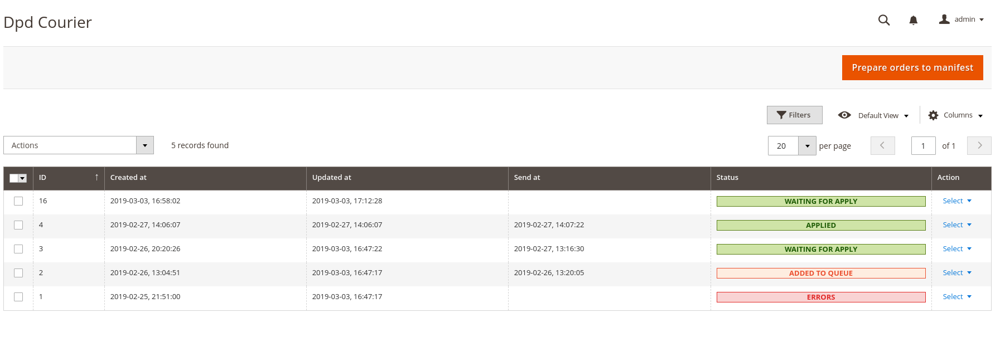

# DPD


Not tested in production!!!!!

Integration with DPD courier.

### Version

1.0.0

### Compatibility

- Magento Open Source 2.2.7

### Installation

```bash
composer require mageviper/module-dpd
```

```bash
php bin/magento module:enable Mageviper_Dpd

php bin/magento setup:upgrade

php bin/magento setup:di:compile

php bin/magento setup:static-content:deploy
```

### Basic use

#### CONFIG

`Stores -> Configuration -> General -> General`
 


`Stores -> Configuration -> Mageviper → Shipping Integration → Dpd`


| NAME                 | DESCRIPTION                                              |DEFAULT            |
|:-------------------- |:---------------------------------------------------------|:------------------|
| Test mode            | Use test api                                             | Enabled           |
| login                | DPD account login                                        | test              |
| password             | DPD account password                                     | thetu4Ee          |
| MasterFid            | DPD MasterFid                                            | 1495              |
| AddressFid           | DPD AddressFid                                           | 1495              |
|                      |                                                          |                   |
| Order Status to send | Collect satuses to manifest                              | -                 |
|                      |                                                          |                   |
|                      | ManifestConfig                                           |                   |
| Label Type           |                                                          | A4                |
| File Type            |                                                          | PDF               |
|                      |                                                          |                   |
|                      | Cron Frequencies                                         |                   |
|Prepare Manifest      | Automatically run cron to prepare or sync manifest data  | Disabled          |
|Queue Processing      | Automatically run cron to prepare packages to DPD        | Disabled          |


#### SHIPPING CONFIG

`Stores -> Configuration -> Sales -> Shipping Methods`


|NAME             |DESCRIPTION                 |
|:----------------|:---------------------------|
| Enabled         | On/off shipping method     |
| Title           | Title on checkout          |
| Price           | Price on checkout          |
| Max weight      | Max parcel weight          |
| Tracking link   | TODO                       |

#### GENERATE MANIFEST

Prepare data `Mageviper -> Dpd Courier -> Prepare orders to mnifest`



| COLUMN       | DESCRIPTION                                                           |
|:-------------|:----------------------------------------------------------------------|
| Create at    | Open manifest collect data                                            |
| Updated at   | Date last collection modification                                     |
| Send at      | Close manifest and send to DPD date                                   |
| Status       | Applied/Added to queue/Errors/Waiting for Apply                       |

|STATUS           |DESCRIPTION                                      | Actions                |
|:----------------|:------------------------------------------------|:-----------------------|
|Applied          |Closed manifest can download protocols and labels|Download protocol/labels|
|Added To Queue   | Cron schedule to apply manifest                 | -                      |
|Processing       |Cron is in progress                              | Renew                  |
|Waiting for apply| You can add new orders before close             | Queue/Sync             |
|Errors           | Problems with create parcels                    | Queue/Sync             |


#### PACKAGES

You can see every package collected by manifest on click on manifest row


|COLUMN         |DESCRIPTION         |
|:--------------|:-------------------|
|Order          | Order Id           |
|Package number | Dpd package number |
|Tracking number| Dpd Tracking number|

Every package could be `send`,`download protocol`,`download label` individually


#### TODO

- [ ] Remove manifests with parcels
- [ ] Manifest and labels archive
- [ ] Set file type and Label type form config 

#### Build With

* t3ko [dpd-pl-api-php](https://github.com/t3ko/dpd-pl-api-php)